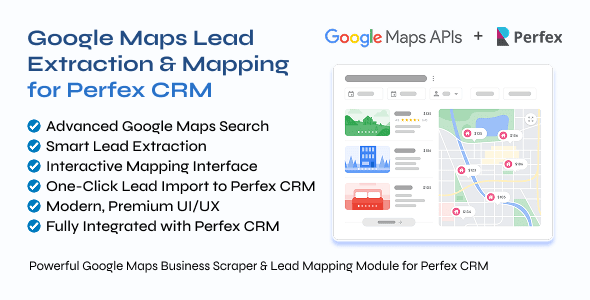
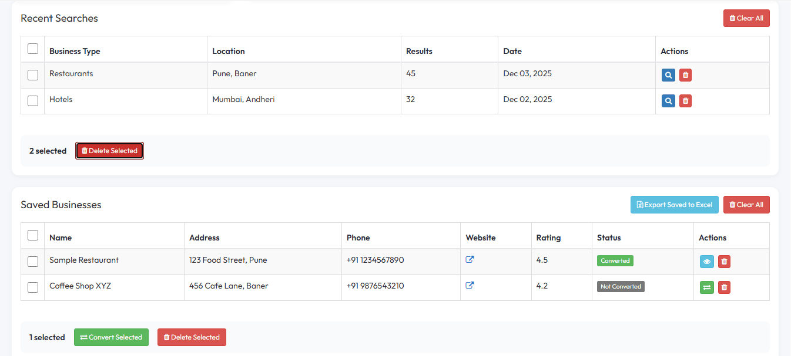

# Google Maps Lead Extraction & Mapping for Perfex CRM

<p align="center">
  
</p>


  
**Author:** Vaibhav Kondekar  
**Category:** Perfex CRM Add-On

> **Important:** This is a **module for Perfex CRM** and **NOT a standalone script**.


# Overview

**Google Maps Lead Extraction & Mapping for Perfex CRM** is a powerful lead generation module designed to help businesses **discover, extract, visualize, and convert Google Maps business data into CRM leads instantly.**

With a **modern UI, interactive mapping system, and smart data extraction**, this module allows your team to build **high-quality targeted lead lists directly inside Perfex CRM.**

Perfect for:

- Digital marketing agencies
- Lead generation companies
- B2B sales teams
- Local service providers
- Real estate professionals
- SaaS companies


# Key Features

## Advanced Business Search

Search Google Maps businesses using:

- Keywords (restaurants, dentists, gyms, etc.)
- City / State / Country
- Radius targeting
- Google category filters

Results are retrieved **directly from Google Maps APIs in real time.**


## Smart Lead Extraction

Extract complete structured business data including:

| Data Field | Description |
|------------|-------------|
| Business Name | Official Google Maps listing |
| Address | Full formatted address |
| Phone Number | Public contact number |
| Website | Business website URL |
| Ratings | Google rating score |
| Reviews | Total review count |
| Photos | Business images |
| Coordinates | Latitude / Longitude |
| Opening Hours | Business working hours |
| Plus Code | Google location identifier |

All data is **cleaned and optimized for CRM usage.**


## Interactive Map Interface

Visualize businesses on a **dynamic Google Map interface**.

Features include:

- Click business markers
- View quick details
- Highlight selected businesses
- Zoom & drag navigation
- Territory planning

Perfect for **regional prospecting and sales mapping**.


## One-Click Lead Import

Convert extracted businesses into:

- Leads
- Customers
- Contacts

Supports:

Single Import  
Bulk Import  

Your team receives **ready-to-contact leads instantly.**


## Flexible Export Options

Export data in multiple formats:

- CSV
- Excel (XLSX)
- JSON

Useful for:

- Marketing campaigns
- Data analysis
- External CRM tools
- Lead pipelines


## Modern UI/UX

The module features a **premium UI designed for Perfex CRM**.

Features:

- Clean sidebar navigation
- Card-based result layout
- Interactive previews
- Smooth animations
- Fully responsive interface

Feels like a **native Perfex CRM feature**.


## Fully Integrated with Perfex CRM

Built following **Perfex CRM development standards**.

Role & permission compatibility  
Multi-user support  
Secure API integration  
Seamless CRM workflow


## Customizable Settings

Configure the module with flexible settings:

- Google Maps API keys
- Search result limits
- Default search location
- Export preferences
- Interface display options


# Screenshots

### Business Search Interface


### Map Visualization


### Extracted Business Results


### CRM Lead Import


# What's Included

- Google Maps Lead Extraction Module
- Clean & optimized PHP + JavaScript source code
- Installation wizard
- API configuration guide
- Full documentation
- Lifetime updates


# Requirements

- **Perfex CRM (latest version recommended)**
- **PHP 8.x**
- **MySQL 8.x**
- **Google Maps API Key**

Required APIs:

- Maps JavaScript API
- Places API
- Geocoding API


# Installation

### Step 1
Upload module folder to:

```
/modules/
```

### Step 2
Login to **Perfex CRM Admin Panel**

### Step 3
Navigate to:

```
Setup → Modules
```

### Step 4
Activate:

```
Google Maps Lead Extractor
```

### Step 5
Open **Module Settings**

### Step 6
Add your **Google Maps API Key**

### Step 7
Start extracting leads


# Google Maps API Setup

1. Open **Google Cloud Console**
2. Create a new project
3. Enable the following APIs:

- Maps JavaScript API
- Places API
- Geocoding API

4. Go to **Credentials**
5. Generate an **API Key**
6. Paste the key into module settings

(Optional) Restrict API usage for better security.


# Module Structure

```
google_maps_extractor/

├── google_maps_extractor.php
├── install.php
├── uninstall.php

├── assets/
│   ├── css/style.css
│   └── js/extractor.js

├── controllers/
│   └── Google_maps_extractor.php

├── models/
│   └── Google_maps_extractor_model.php

├── views/
│   ├── index.php
│   └── settings.php

└── language/english/
    └── google_maps_extractor_lang.php
```


# Fixes & Improvements

### Excel Export Button
Position fixed at **top-right of results section**

### Clear All Button
Now fully functional in:

- Recent Searches
- Saved Businesses

### Bulk Select
Checkbox multi-selection fixed

### Clear Buttons
All clear/delete functions implemented

### Export Saved Businesses
Export saved records directly to **Excel**

### Loading Indicators
Added loaders for:

- Search
- Data extraction
- Export operations


# Documentation

Detailed documentation included:

- Installation guide
- Configuration instructions
- API setup tutorial
- Troubleshooting
- Best practices


# Support

Professional support available for:

- Installation help
- Setup assistance
- Bug fixes
- Compatibility issues
- Feature guidance


# Feature Requests

We continuously improve this module.

Have an idea or feature request?  
Submit it — it may be included in future updates.


# Roadmap

Upcoming improvements may include:

- Automated lead scraping scheduler
- Email extraction enhancement
- Google Maps category intelligence
- Lead scoring system
- CRM analytics dashboard


# License

This module is distributed for **Perfex CRM users** and must comply with Perfex licensing rules.


If you like this module, consider starring the repository!
